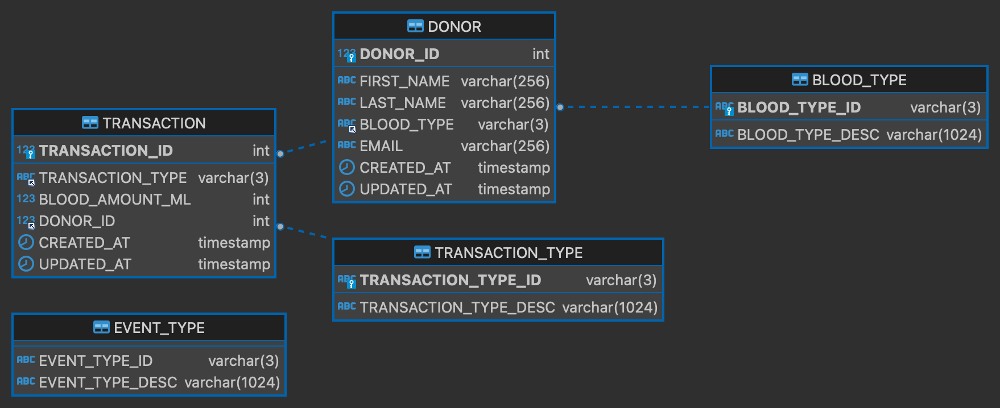
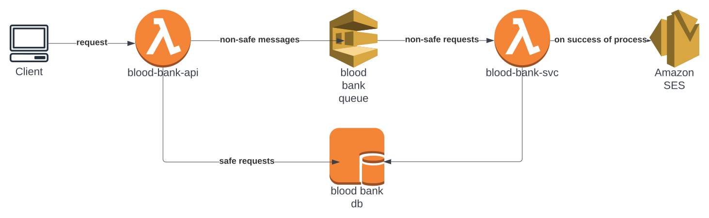

# blood-bank-api

Development: Complete

## Description

This is a backend API for a blood bank. This api only actually queries the database on GET requests. For POST requests, the API sends a message to an SQS queue. This queue's listener will do the subsequent database insertions. This design was chosen as the POST request is computationally demanding, so to provide the best ux and free the user up, the computations are delegated.

This repo contains two GitHub actions. One is for continuous integration, whereas the other is for continuous deployment to an AWS lambda.
## Getting Started

## Database structure

## Cloud Architecture

## Contributing

## Authors
- matttm : Matt Maloney : matttmaloney@gmail.com
## Issues
If you encounter an issue or a discrepency in the documentation, please message me or open an issue.
## License
This project is licensed under the MIT License - see the LICENSE.md file for details

